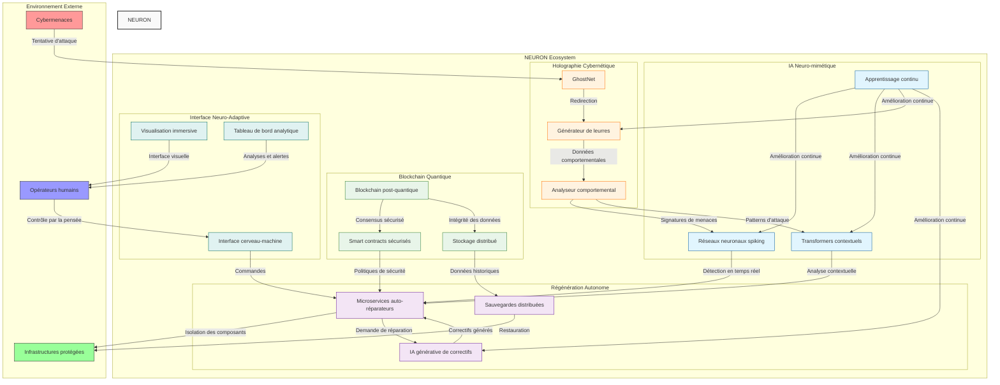

# Diagramme d'Architecture NEURON

Le diagramme ci-dessous illustre l'architecture globale du système NEURON et les interactions entre ses différents composants.

## Légende

### Composants principaux
- **IA Neuro-mimétique** : Système d'intelligence artificielle inspiré du fonctionnement neuronal du cerveau humain
- **Blockchain Quantique** : Infrastructure distribuée pour le stockage sécurisé et la coordination
- **Holographie Cybernétique** : Système de leurres et d'analyse des attaquants
- **Régénération Autonome** : Mécanismes d'auto-réparation et de récupération
- **Interface Neuro-Adaptive** : Point d'interaction avec les opérateurs humains

### Flux de données principaux
1. Les cybermenaces sont détectées et redirigées vers le système GhostNet
2. Les attaquants interagissent avec des leurres qui récoltent des données sur leurs méthodes
3. L'IA neuro-mimétique analyse les comportements et détecte les patterns d'attaque
4. Le système de régénération autonome isole les composants compromis et applique des correctifs
5. Les opérateurs humains peuvent superviser et interagir avec le système via l'interface neuro-adaptive

## Principes architecturaux

1. **Architecture distribuée** : Pas de point unique de défaillance
2. **Défense en profondeur** : Multiples couches de protection
3. **Auto-adaptation** : Apprentissage et évolution constants
4. **Résilience intégrée** : Capacité à maintenir les opérations même sous attaque

Cette architecture reflète l'approche bio-inspirée de NEURON, où chaque composant travaille de manière autonome tout en contribuant à l'intelligence collective du système.
